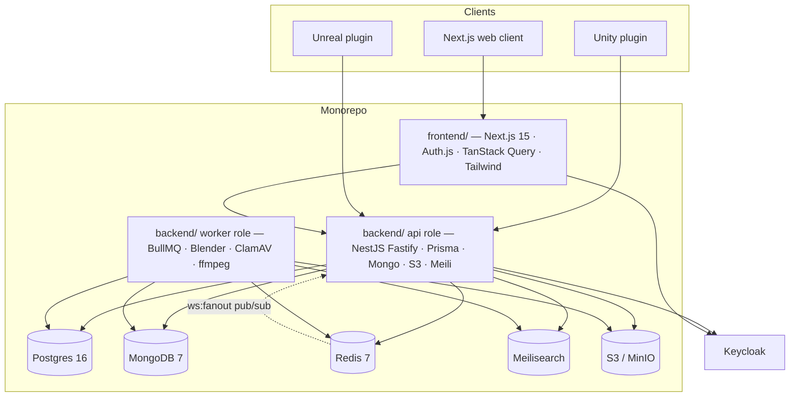

# MGM Asset Library

A centralized, internal digital asset library for the MGM research lab and its
partners — think "Unity Asset Store, but private". Teams share `.unitypackage`
files, `.uplugin` modules, full Unreal projects, 2D/3D models, VFX, audio,
animations, tools, and scripts with a web UI at
[`asset.labmgm.org`](https://asset.labmgm.org) and an API at
[`asset-api.labmgm.org`](https://asset-api.labmgm.org).

This repository is a **monorepo** containing the two server-side pieces of the
platform:

| Workspace member                | Purpose                                                                    |
| ------------------------------- | -------------------------------------------------------------------------- |
| [`frontend/`](./frontend)       | Next.js 15 web client served at `asset.labmgm.org`.                        |
| [`backend/`](./backend)         | NestJS REST API, BullMQ workers, database, search, and file pipeline.      |

Two companion repositories hold the editor integrations and live outside this
monorepo: `mgm-asset-library-unity` (Unity editor plugin) and
`mgm-asset-library-unreal` (Unreal editor plugin). They talk to the same API
through plugin device tokens.

## Overview

- **Full asset lifecycle** — create drafts, upload files (single-shot and
  multipart presigned S3 uploads), publish, archive, restore, soft-delete,
  and transfer ownership. Versions carry an engine compatibility matrix and
  an `isLatest` flag swapped transactionally.
- **Catalog + discovery** — categories, tags, licenses, filtered listing
  with cursor pagination, a composite `/discover` landing payload, featured
  slots (capped at 5), recommendations, and Meilisearch-backed search with
  fuzzy tag autocomplete.
- **File analysis pipeline** — BullMQ workers extract metadata from
  `.unitypackage`, `.uplugin`, `.uproject`, FBX/OBJ/GLTF/BLEND, images,
  audio/video, code, and archives. Per-file jobs fan in through a Redis
  counter into the version rollup that writes the manifest, flips status,
  and triggers conversion + reindex.
- **Safety** — ClamAV INSTREAM scanning (500 MB streaming cap) with
  quarantine flows, publish checklist with AV-warning acknowledgement,
  rate limiting on abuse-prone surfaces, and a `@RequireConfirmation` guard
  on destructive admin operations.
- **glTF conversion & thumbnails** — Blender → glTF-pipeline → `gltfpack`
  derived web-viewer outputs, plus six WebP thumbnail variants and a
  headless Eevee auto-render for 3D previews.
- **Notifications** — 13 typed event payloads delivered in-app, over a
  WebSocket gateway (`/ws`, with Redis pub/sub fan-out across replicas),
  by MJML email (en/id), and through an n8n webhook bus.
- **Community features** — threaded comments and issues (depth-5 cap, Lite
  TipTap validation), asset requests with an admin review queue, and a
  report system with atomic admin actions.
- **Admin panel** — dashboard, storage rollup, moderation, featured
  management, categories/tags/licenses CRUD, user promotion with a
  last-admin guard, audit log, AV queue, Bull Board, and Prometheus metrics.
- **Ops hardening** — locked-down CSP, HSTS, request-ID correlation,
  structured Pino logging, Sentry, health endpoints (`/healthz`, `/readyz`),
  and a production [runbook](./backend/docs/RUNBOOK.md).



The API process is split by `PROCESS_ROLE` (`api` | `worker`): API replicas
only enqueue BullMQ jobs while worker replicas run every processor and the
cron maintenance tasks. Two backend images (`backend/Dockerfile` and
`backend/Dockerfile.worker`) ship accordingly.

---

## Repository layout

```
.
├── backend/                  # NestJS API + workers (workspace member)
│   ├── prisma/               # schema.prisma + consolidated migration script
│   ├── scripts/              # seed, reindex, openapi export, ops helpers
│   ├── src/                  # modules, infra, common, config
│   ├── test/                 # unit, integration, and e2e suites
│   └── docs/RUNBOOK.md       # production operations reference
├── frontend/                 # Next.js 15 web client (workspace member)
│   ├── src/app/              # App Router pages and API routes
│   ├── src/components/       # ui, asset, admin, publish, navigation, …
│   ├── messages/             # i18n catalogs (en, id)
│   ├── tests/                # unit + Playwright e2e suites
│   └── DESIGN_SYSTEM.md      # design tokens and primitive specs
├── .github/workflows/        # CI, staging CD, production CD
├── docker-compose.yml        # local full stack (infra + api + worker + web)
├── docker-compose.prod.yml   # production images stack
├── WS_PROTOCOL.md            # WebSocket gateway protocol (shared)
└── package.json              # pnpm workspace root
```

---

## 1. Prerequisites

### 1.1 Development workstation

| Tool  | Version                                             |
| ----- | --------------------------------------------------- |
| Node  | ≥ 20                                                |
| pnpm  | 9.x (corepack picks the pinned version from `packageManager`) |
| Docker | ≥ 24 with Compose v2 (for the local stack)         |
| Git   | ≥ 2.40                                              |

### 1.2 External services

The local `docker compose` stack provisions Postgres, MongoDB, Redis,
Meilisearch, and MinIO for development. In staging/production these are
managed externally. **Keycloak** is always external — the platform team
operates the realm; both apps only consume
`KEYCLOAK_ISSUER_URL` / `KEYCLOAK_JWKS_URI` / client credentials. Mailtrap
SMTP and an n8n webhook are optional outbound integrations.

---

## 2. Getting started

```bash
git clone git@github.com:MGM-Laboratory/mgm-asset-library.git
cd mgm-asset-library

# 1) Environment files (defaults match docker-compose.yml)
cp backend/.env.example backend/.env
cp frontend/.env.example frontend/.env.local

# 2) Install the workspace (single lockfile at the repo root)
pnpm install

# 3) Start the infrastructure + all three containers
docker compose up -d --build

# 4) Apply the database migration and seed reference data
pnpm db:migrate:dev      # prisma migrate dev — applies migrations/generates client
pnpm db:seed             # bootstrap admin, categories, licenses

# 5) Run the apps on the host (or use the compose containers)
pnpm dev                 # API on :4000 and web on :3000 in parallel
```

Then:

- Web client — `http://localhost:3000` (public `/about` only; everything
  else requires sign-in)
- API — `http://localhost:4000`
- Swagger UI — `http://localhost:4000/docs`
- Liveness / readiness — `GET /healthz`, `GET /readyz`
- Worker health & metrics — `http://localhost:4001` (`/healthz`, `/metrics`)
- Bull Board — `GET /admin/queues` (admin-only)
- Primitive playground — `/dev/components` (non-production builds)

Without a running Keycloak, set `NEXT_PUBLIC_AUTH_MOCK=true` in
`frontend/.env.local` to synthesize an admin session for offline
development. **The runtime refuses this flag when `NODE_ENV=production`.**

### MinIO local buckets

The MinIO container starts empty. Create the configured buckets once:

```bash
docker run --rm --network host minio/mc \
  alias set local http://localhost:9000 mgm mgm-secret
docker run --rm --network host minio/mc \
  mb -p local/mgm-asset-library-assets local/mgm-asset-library-thumbs local/mgm-asset-library-editor
```

---

## 3. Database migrations & seeding

The schema is managed through `backend/prisma/schema.prisma`, and the whole
database is created by **one consolidated migration script** shipped at
`backend/prisma/migrations/0001_init/migration.sql`. There is no per-feature
migration sprawl — a fresh environment is one `migrate deploy` away from a
fully provisioned schema (28 tables, all enums, indexes, and foreign keys).

| Command                    | Use                                                              |
| -------------------------- | ---------------------------------------------------------------- |
| `pnpm db:migrate`          | `prisma migrate deploy` — apply pending migrations (CI/prod boot) |
| `pnpm db:migrate:dev`      | `prisma migrate dev` — create + apply a new migration locally    |
| `pnpm db:generate`         | Regenerate the Prisma client                                     |
| `pnpm db:seed`             | Idempotent bootstrap: admin user, categories, licenses           |
| `pnpm db:studio`           | Prisma Studio                                                    |

The production API image runs `prisma migrate deploy` automatically on
container start, before the HTTP server binds — deploys are migration-safe
by default. Migrations are forward-only; see the
[runbook](./backend/docs/RUNBOOK.md) for the emergency rollback procedure.

`pnpm db:seed` upserts a bootstrap admin keyed on `ADMIN_BOOTSTRAP_EMAIL`
(the `keycloakSub` is a placeholder overwritten on first real login), ten
default categories with en/id labels, and seven license templates. Running
it repeatedly is safe.

---

## 4. Frontend guide

### 4.1 Auth

Authentication is delegated to Keycloak via Auth.js v5:

- Sign-in redirects through `/auth/signin` to Keycloak's hosted login.
- `frontend/src/middleware.ts` gates every route except the public
  allowlist (`/about`, `/auth/*`, `/api/auth/*`, `/_next/*`, `/brand/*`,
  `/patterns/*`, `/favicon*`, `/robots.txt`, `/sitemap.xml`, `/403`).
- Server helpers live in `frontend/src/lib/auth/server.ts`:
  `getSession()`, `requireSession(callbackUrl?)`, `fetchMe(session)`,
  `requireAdmin()`.
- The Keycloak `access_token` is forwarded on every API call; refresh
  happens in `callbacks.jwt` within 60 s of expiry.
- Roles: **Admin** (bootstrapped via `admin@labmgm.org`) · **Contributor**
  (published ≥ 1 asset) · **User** (default).

### 4.2 i18n

Powered by `next-intl`. Catalogs live in `frontend/messages/{en,id}.json`.
Locale resolution: `User.locale` (set via the switcher) → `NEXT_LOCALE`
cookie → `accept-language` header → `NEXT_PUBLIC_DEFAULT_LOCALE`. Dates,
numbers, and byte sizes are formatted through locale-aware helpers in
`frontend/src/lib/format.ts`.

### 4.3 Design system

All visual primitives derive from `frontend/DESIGN_SYSTEM.md`. Tokens flow
into CSS custom properties (`frontend/src/styles/globals.css`) and Tailwind
(`frontend/tailwind.config.ts`), and are consumed by the primitives in
`frontend/src/components/ui/` and the brand components. The geometric
background pattern composes 80 deterministic tiles from
`frontend/public/patterns/`.

The MGM mark is a build-time artifact at `frontend/public/brand/mgm-logo.svg`
— replace the file and rebuild; there is no runtime swap or admin upload.

### 4.4 OpenAPI sync

The frontend's typed API client (`frontend/src/lib/api/schema.ts`) is
generated from the backend's OpenAPI document. `pnpm openapi:sync` exports
the backend spec (`backend/openapi.json`) and regenerates the client. The
generator resolves its source in this order: `OPENAPI_SOURCE` env var →
`backend/openapi.json` (workspace sibling) → the bundled copy in
`frontend/openapi.json`. CI fails the build if the checked-in schema is
stale.

---

## 5. Backend guide

### 5.1 Running the worker

The worker container runs alongside the API with the same environment plus
`PROCESS_ROLE=worker`. The heavy media toolchain (Blender, ClamAV, ffmpeg,
`gltf-pipeline`, `gltfpack`, and a Python venv with `trimesh`/`pyassimp`) is
baked into `backend/Dockerfile.worker` — nothing extra to install on the
worker host.

`/readyz` on the worker also reports `avDefinitionsUpdatedAt` so ops can
watch freshclam staleness without paging into the container.

### 5.2 Search reindex

`pnpm reindex` ensures the `assets` and `tags` indexes exist with canonical
settings. Runtime updates are handled by a debounced 5-second batch worker;
manual reindexing is reserved for cold-start and disaster recovery.

### 5.3 WebSocket gateway

`WSS /ws` authenticates via `?token=<keycloakToken>` or
`?pluginToken=<deviceToken>`. The message envelope is specified in
[WS_PROTOCOL.md](./WS_PROTOCOL.md), shared by both workspace members.

### 5.4 Plugin device tokens

Unity/Unreal clients exchange a Keycloak token for a long-lived device
token (`POST /auth/plugin/exchange`) and slide/revoke it via
`/auth/plugin/{refresh,devices,revoke}`. `PLUGIN_TOKEN_PEPPER` is required
in production.

---

## 6. Environment reference

Both apps validate their environment at boot and fail fast with an
aggregated error. Canonical, commented lists live in
[`backend/.env.example`](./backend/.env.example) and
[`frontend/.env.example`](./frontend/.env.example). Highlights:

| Group              | App      | Notes                                                                  |
| ------------------ | -------- | ---------------------------------------------------------------------- |
| Runtime            | backend  | `NODE_ENV`, `PROCESS_ROLE`, `PORT`, `PUBLIC_BASE_URL`, `CORS_ORIGINS`.  |
| Postgres / Mongo   | backend  | Compose defaults work out of the box.                                  |
| Redis              | backend  | BullMQ + JWKS cache + `ws:fanout`.                                      |
| Keycloak           | both     | Issuer URL, audience, JWKS URI; client credentials on the frontend.    |
| S3                 | backend  | Local: MinIO at `http://minio:9000`; production: AWS S3 (endpoint blank). |
| Meilisearch        | backend  | Master key optional in dev.                                            |
| SMTP / n8n         | backend  | Blank host/URL makes each integration a no-op.                         |
| Sentry             | both     | Blank DSN disables telemetry.                                          |
| Public URLs        | frontend | `NEXT_PUBLIC_*` values are inlined at build time.                      |
| Auth               | frontend | `NEXTAUTH_*`, `KEYCLOAK_*`, `SESSION_MAX_AGE_SECONDS`.                 |
| Feature flags      | backend  | `FEATURE_SWAGGER_PUBLIC`, `FEATURE_QUEUE_DASHBOARD`.                   |

The authoritative backend shape lives in `backend/src/config/env.schema.ts`;
the frontend's in `frontend/src/lib/env.ts`.

---

## 7. Scripts

Run any script from the repository root. `pnpm -F <name>` targets a single
workspace member (`mgm-asset-library-backend` / `mgm-asset-library-frontend`).

```bash
pnpm dev               # API (:4000) + web (:3000) in watch mode, in parallel
pnpm dev:backend       # Nest watch mode only
pnpm dev:frontend      # next dev only
pnpm build             # production builds for both members
pnpm lint / typecheck  # workspace-wide lint and TypeScript checks
pnpm test              # backend Jest suite + frontend Vitest suite
pnpm test:e2e          # backend e2e (needs docker compose -f backend/docker-compose.test.yml up -d)
pnpm test:e2e:web      # frontend Playwright suite
pnpm format            # Prettier across the workspace
pnpm db:migrate        # prisma migrate deploy
pnpm db:migrate:dev    # prisma migrate dev
pnpm db:seed           # idempotent bootstrap data
pnpm db:studio         # Prisma Studio
pnpm openapi:sync      # export backend OpenAPI + regenerate the frontend client
pnpm reindex           # rebuild Meilisearch indexes
pnpm docker:up / docker:down / docker:prod
```

---

## 8. Docker

```bash
# Development — full stack (Postgres, Mongo, Redis, Meilisearch, MinIO,
# API, worker, web), built from source:
docker compose up -d --build

# Production — prebuilt images only (infra is managed externally):
docker compose -f docker-compose.prod.yml up -d
```

All three app images are built with the **repository root as context** so
the pnpm workspace manifests and lockfile are available during install:

```bash
docker build -f backend/Dockerfile .
docker build -f backend/Dockerfile.worker .
docker build -f frontend/Dockerfile .
```

The web image serves the Next.js standalone build; the API image applies
database migrations on boot; the worker image ships the full media toolchain.

---

## 9. CI/CD

| Workflow                     | Trigger                         | Purpose                                    |
| ---------------------------- | ------------------------------- | ------------------------------------------ |
| `.github/workflows/ci.yml`   | PRs, pushes to `main`/`staging`/`production`, manual | Path-filtered jobs per app: lint → typecheck → test → build (+ OpenAPI freshness checks) |
| `.github/workflows/staging.yml` | PRs to any branch, manual    | CI, then build & push `api`/`worker`/`web` images tagged `staging-*` |
| `.github/workflows/production.yml` | Push to `main`, manual     | CI, then build & push the three images tagged `latest-*` |

The `staging` and `production` branches should be protected: updates only
via pull request, CI must pass, and at least one approving review is
required. See the [runbook](./backend/docs/RUNBOOK.md) for host deployment
details (SWAG TLS termination, sops+age secrets, rollback procedure).

---

## 10. API surface

The full endpoint reference is the OpenAPI document
([`backend/openapi.json`](./backend/openapi.json), served live at `/docs`).
In broad strokes:

- **Auth / me** — `/auth/me`, `/auth/me/locale`, plugin token endpoints, `/me`,
  `/me/devices/:id/revoke`, `/me/analytics/*`.
- **Catalog** — `/categories`, `/tags`, `/licenses`, `/users/search`.
- **Assets** — CRUD, publish, archive/restore, `/discover`, recommended,
  publish-checklist.
- **Versions & files** — nested version CRUD, compatibility matrix, presigned
  uploads (single-shot, multipart, thumbnails, editor media), reanalyze.
- **Library & downloads** — `/library`, `/downloads/options`, signed-URL
  issuance with download recording.
- **Search** — `/search/assets`, `/search/tags` (Meilisearch).
- **Community** — comments/issues (threaded, depth ≤ 5), asset requests,
  reports (rate-limited), notifications inbox.
- **Realtime** — `WSS /ws` (see [WS_PROTOCOL.md](./WS_PROTOCOL.md)).
- **Admin** — `/admin/*` namespace: dashboard, storage, assets moderation,
  reports, asset requests, featured, categories, tags, licenses, users,
  audit, AV queue, analytics, queues (Bull Board), webhook deliveries.
- **Ops** — `/healthz`, `/readyz`, `/metrics` (admin or CIDR allow-list).

Rate-limited surfaces: `POST /reports` (5/user/day), `POST /asset-requests`
(20/user/day), `POST /comments` (60/user/min), `POST /auth/plugin/exchange`
(20/IP/min).

---

## 11. Coding conventions

- TypeScript strict mode; ESLint + Prettier enforced by Husky pre-commit
  hooks (root `.husky/`, config in the root `package.json`).
- Conventional Commits for all changes.
- No `console.log` in committed code — use the Pino logger (`nestjs-pino`)
  on the backend and the structured `frontend/src/lib/logger.ts` on the web.
- Backend DTOs live in each module's `dto/` folder and are validated by a
  global `ValidationPipe` (whitelist + forbidNonWhitelisted).
- List endpoints use cursor pagination (`{ items, nextCursor, hasMore }`);
  cursors are base64url JSON of `{ createdAt, id }`.
- All API timestamps are ISO 8601 UTC strings.
- Mutating admin handlers carry `@AuditAction('verb.subject')` markers wired
  through the global audit interceptor.

---

## License

MIT — see [LICENSE](./LICENSE).
