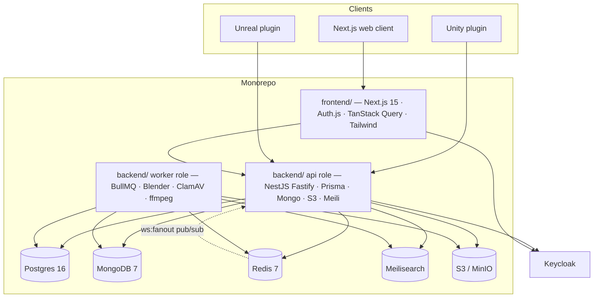

# MGM Asset Library

A centralized, internal digital asset library for the MGM research lab and its
partners — think "Unity Asset Store, but private". Teams share `.unitypackage`
files, `.uplugin` modules, full Unreal projects, 2D/3D models, VFX, audio,
animations, tools, and scripts with a web UI at
[`asset.labmgm.org`](https://asset.labmgm.org) and an API at
[`asset-api.labmgm.org`](https://asset-api.labmgm.org).

This repository is a **monorepo** containing the two server-side pieces of the
platform:

| Workspace member                | Purpose                                                                    |
| ------------------------------- | -------------------------------------------------------------------------- |
| [`frontend/`](./frontend)       | Next.js 15 web client served at `asset.labmgm.org`.                        |
| [`backend/`](./backend)         | NestJS REST API, BullMQ workers, database, search, and file pipeline.      |

Two companion repositories hold the editor integrations and live outside this
monorepo: `mgm-asset-library-unity` (Unity editor plugin) and
`mgm-asset-library-unreal` (Unreal editor plugin). They talk to the same API
through plugin device tokens.

## Overview

- **Full asset lifecycle** — create drafts, upload files (single-shot and
  multipart presigned S3 uploads), publish, archive, restore, soft-delete,
  and transfer ownership. Versions carry an engine compatibility matrix and
  an `isLatest` flag swapped transactionally.
- **Catalog + discovery** — categories, tags, licenses, filtered listing
  with cursor pagination, a composite `/discover` landing payload, featured
  slots (capped at 5), recommendations, and Meilisearch-backed search with
  fuzzy tag autocomplete.
- **File analysis pipeline** — BullMQ workers extract metadata from
  `.unitypackage`, `.uplugin`, `.uproject`, FBX/OBJ/GLTF/BLEND, images,
  audio/video, code, and archives. Per-file jobs fan in through a Redis
  counter into the version rollup that writes the manifest, flips status,
  and triggers conversion + reindex.
- **Safety** — ClamAV INSTREAM scanning (500 MB streaming cap) with
  quarantine flows, publish checklist with AV-warning acknowledgement,
  rate limiting on abuse-prone surfaces, and a `@RequireConfirmation` guard
  on destructive admin operations.
- **glTF conversion & thumbnails** — Blender → glTF-pipeline → `gltfpack`
  derived web-viewer outputs, plus six WebP thumbnail variants and a
  headless Eevee auto-render for 3D previews.
- **Notifications** — 13 typed event payloads delivered in-app, over a
  WebSocket gateway (`/ws`, with Redis pub/sub fan-out across replicas),
  by MJML email (en/id), and through an n8n webhook bus.
- **Community features** — threaded comments and issues (depth-5 cap, Lite
  TipTap validation), asset requests with an admin review queue, and a
  report system with atomic admin actions.
- **Admin panel** — dashboard, storage rollup, moderation, featured
  management, categories/tags/licenses CRUD, user promotion with a
  last-admin guard, audit log, AV queue, Bull Board, and Prometheus metrics.
- **Ops hardening** — locked-down CSP, HSTS, request-ID correlation,
  structured Pino logging, Sentry, health endpoints (`/healthz`, `/readyz`),
  and a production [runbook](./backend/docs/RUNBOOK.md).



The API process is split by `PROCESS_ROLE` (`api` | `worker`): API replicas
only enqueue BullMQ jobs while worker replicas run every processor and the
cron maintenance tasks. Two backend images (`backend/Dockerfile` and
`backend/Dockerfile.worker`) ship accordingly.

---

## Repository layout

```
.
├── backend/                  # NestJS API + workers (workspace member)
│   ├── prisma/               # schema.prisma + consolidated migration script
│   ├── scripts/              # seed, reindex, openapi export, ops helpers
│   ├── src/                  # modules, infra, common, config
│   ├── test/                 # unit, integration, and e2e suites
│   └── docs/RUNBOOK.md       # production operations reference
├── frontend/                 # Next.js 15 web client (workspace member)
│   ├── src/app/              # App Router pages and API routes
│   ├── src/components/       # ui, asset, admin, publish, navigation, …
│   ├── messages/             # i18n catalogs (en, id)
│   ├── tests/                # unit + Playwright e2e suites
│   └── DESIGN_SYSTEM.md      # design tokens and primitive specs
├── .github/workflows/        # CI, staging CD, production CD
├── docker-compose.yml        # local full stack (infra + api + worker + web)
├── docker-compose.prod.yml   # production images stack
├── WS_PROTOCOL.md            # WebSocket gateway protocol (shared)
└── package.json              # pnpm workspace root
```

---

## 1. Prerequisites

### 1.1 Development workstation

| Tool  | Version                                             |
| ----- | --------------------------------------------------- |
| Node  | ≥ 20                                                |
| pnpm  | 9.x (corepack picks the pinned version from `packageManager`) |
| Docker | ≥ 24 with Compose v2 (for the local stack)         |
| Git   | ≥ 2.40                                              |

### 1.2 External services

The local `docker compose` stack provisions Postgres, MongoDB, Redis,
Meilisearch, and MinIO for development. In staging/production these are
managed externally. **Keycloak** is always external — the platform team
operates the realm; both apps only consume
