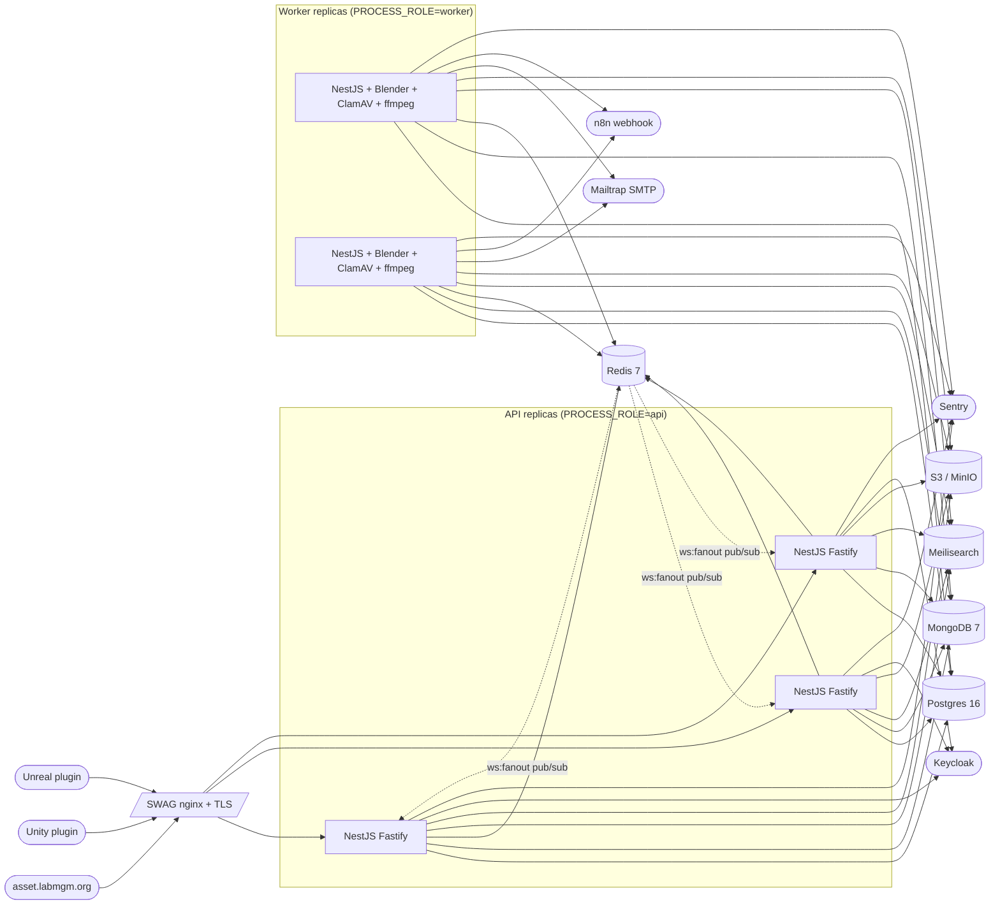

# MGM Asset Library — Backend production runbook

Operator-facing reference for everything you need to deploy, observe, and
recover the backend. Pair with the README for development setup.

## 1. Architecture



- API replicas are stateless; scale horizontally behind SWAG.
- Workers consume from the shared Redis (BullMQ); cron tasks land on a
  single worker via BullMQ's repeatable-job dedup.
- Postgres + Mongo + Redis + Meilisearch + S3 are managed externally
  (separate compose stacks or managed services).
- Keycloak is owned by the platform team; the backend only verifies tokens.

## 2. First-time provisioning

### 2.1 API host

Plain Linux VM with Docker + Docker Compose:

```bash
sudo apt-get update
sudo apt-get install -y docker.io docker-compose-plugin
sudo usermod -aG docker deploy
sudo mkdir -p /srv/mgm-asset-library
sudo chown deploy:deploy /srv/mgm-asset-library
```

Drop `backend/.env` (see `secrets management` below), `frontend/.env.local`,
and `docker-compose.prod.yml` from the monorepo root, and you're done. The
image is pulled by the GitHub Actions deploy job. All paths in this runbook
are relative to the monorepo root.

### 2.2 Worker host

Worker images ship the heavy toolchain (Blender, ClamAV, ffmpeg, Python
venv with `trimesh`/`pyassimp`/`pillow`, `gltf-pipeline`, `gltfpack`).
**Nothing additional needs to be installed on the host** — the container
contains it all. See `backend/Dockerfile.worker` for the canonical list.

If you prefer running outside Docker, replicate that block on the host
verbatim from README §2.2 + Part 3 §14.

### 2.3 External services

| Service        | Notes                                                                                                 |
| -------------- | ----------------------------------------------------------------------------------------------------- |
| Postgres 16    | Logical replication-ready; enable `pg_stat_statements`.                                              |
| MongoDB 7      | Single replica set OK; TTL index on `webhook_deliveries.createdAt` is set at app init.                |
| Redis 7        | AOF on (BullMQ relies on persistence). Separate DB number per env (use `?db=0` / `?db=9` for E2E).    |
| Meilisearch    | At least 1.10. Disk-backed; rebuildable from `pnpm reindex` if corrupted.                             |
| S3 (or MinIO)  | Versioning **on** for `assets`; **off** is fine for `thumbs` and `editor-media`.                      |
| Keycloak       | Realm `mgm`, client `mgm-asset-library`. Access-token TTL 30 days; refresh-token TTL 365 days.        |

## 3. Secrets management

Recommend [`sops` + `age`](https://github.com/getsops/sops) committed to a
private ops repo:

```bash
# One-time on each host:
sudo install -m 600 /dev/stdin /etc/mgm/age.key < <(age-keygen)
# In the ops repo:
sops -e -i .env.production.sops.yaml
# Decrypt to host at deploy time:
sops -d .env.production.sops.yaml > /srv/mgm-asset-library/.env
chmod 600 /srv/mgm-asset-library/.env
```

Docker Compose v2 also supports the `secrets:` block — fine if your stack
runs in Swarm or similar. Avoid plaintext env files in source control.

## 4. Migrations

The database schema ships as **one consolidated migration script** at
`backend/prisma/migrations/0001_init/migration.sql`, managed through
`backend/prisma/schema.prisma` as the single source of truth.

The API image applies it automatically on boot (`prisma migrate deploy`
is baked into the container CMD), so deploys are migration-safe by default:

```bash
# Manually, inside the freshly built image, before swapping traffic:
docker run --rm --env-file backend/.env $IMAGE pnpm prisma migrate deploy
```

`prisma migrate deploy` is what the `production.yml` / `staging.yml`
workflows' images run on start. Migrations are forward-only — see Rollback
for emergency reversal.

## 5. Rollback

The image tag is the rollback unit. Every deploy logs the tag to
`/srv/mgm-asset-library/.image-tag` on the host. To roll back:

```bash
cd /srv/mgm-asset-library
export IMAGE=ghcr.io/mgm-laboratory/mgm-asset-library-api:latest-<prev-sha>
docker compose -f docker-compose.prod.yml pull
docker compose -f docker-compose.prod.yml up -d
```

**Database migrations are forward-only.** If a migration introduced a
breaking schema change AND the previous app image cannot read the new
schema, you must roll the DB back too. Procedure:

1. `pg_restore` from last night's backup (see §8).
2. Mark the rolled-back migrations in `_prisma_migrations` as
   `rolled_back`.
3. Re-deploy the previous image.

This is rare but worth practicing in staging once a quarter.

## 6. Health-check expectations

| Probe       | Purpose                                                                                |
| ----------- | -------------------------------------------------------------------------------------- |
| `/healthz`  | Liveness. Always 200 while the process is alive. Use for orchestration restart.        |
| `/readyz`   | Readiness. 200 only when every downstream is reachable. Use as load-balancer gate.     |
